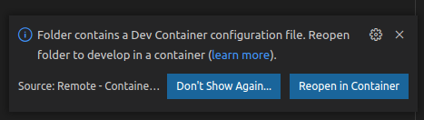
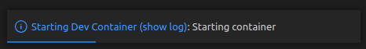
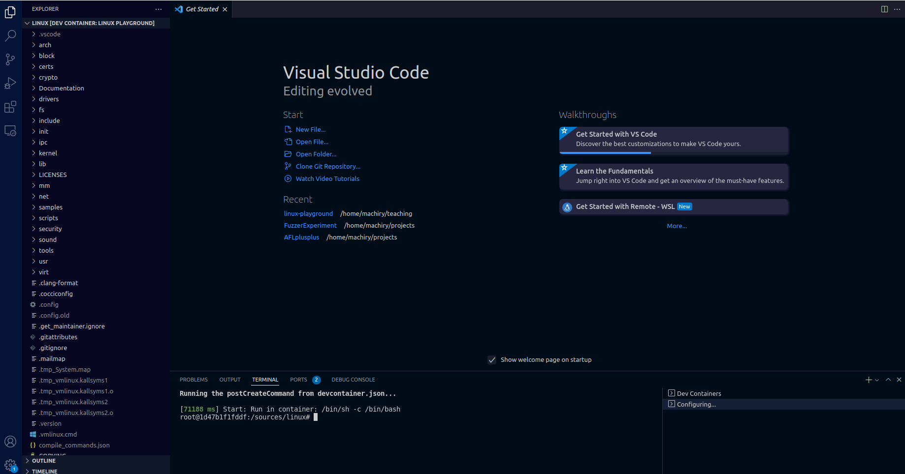

# linux-playground

This is a playground to play with the Linux kernel, providing an easy way to build and debug kernel inside a Docker container.

> The following steps are verified on Ubuntu 22.04, x86-64 machine.

## Prerequisites
The following are the packages and tools that are required to use this repo.
### Resources
We expect the machine to have at least 8 GB of free disk space.

#### VScode
* Install VSCode by following the [official instructions](https://code.visualstudio.com/docs/setup/linux).
* Install Remote Development extension in VSCode (Identifier : ms-vscode-remote.vscode-remote-extensionpack) - Refer [instructions](https://code.visualstudio.com/learn/get-started/extensions) on how to install extensions.


#### Docker and utils
* Follow [official instructions](https://docs.docker.com/engine/install/ubuntu/)
##### Add your user to the docker group
 
- Create docker group : ```sudo groupadd docker```
- Add your user to the docker group : ```sudo usermod -aG docker $USER```
- Reboot or logout and login again

## Setup and Build Docker

> Note: all our steps are expected to work with VSCode. You may be able to use our image without VSCode but we do not currently support it.

Clone the playground repository: 

```bash
git clone https://github.com/purs3lab/linux-playground.git
```

The playground is integrated into the VSCode IDE. So start by opening the `linux-playground` folder in the VSCode IDE. 

```bash
code linux-playground
```

Once the playground is open, in VSCode you may see a message window at the bottom right of the editor window:




Click on **Reopen in Container**

This command will build the relevant container image and bring up the workspace in the new environment. 

The VSCode will restart and you will see the following message at the bottom right of the window



This may take a while. Once this process is done you should get your workspace now open inside the container. 
If you open a terminal from inside VS Code you should get a prompt from inside the container and everything.

At this point your VScode window should contain the linux kernel sources and you should see the following:





### Build FS Image

Since we are trying to mount a basic filesystem, it needs to be built before you are able to start the playground. 

Once you are inside the container, you can build the filesystem by opening the command palette using <kbd>Ctrl</kbd> + <kbd>Shift</kbd> + <kbd>P</kbd> and typing:  ``` Tasks: Run Task ```


Which should give you a prompt with multiple options (This is the VSCode Tasks List). 


Select the ``` (Needed) build-fs ``` option. This should create the filesystem that would be used by the kernel.

**Note** : If you want to run the same command without using vscode, you should be able to find a bash script at `/scripts/build-fs.sh`

## Next steps

[Debugging the kernel](docs/DebugKernel.md)

[Modifying the kernel](docs/ModifyKernel.md)
