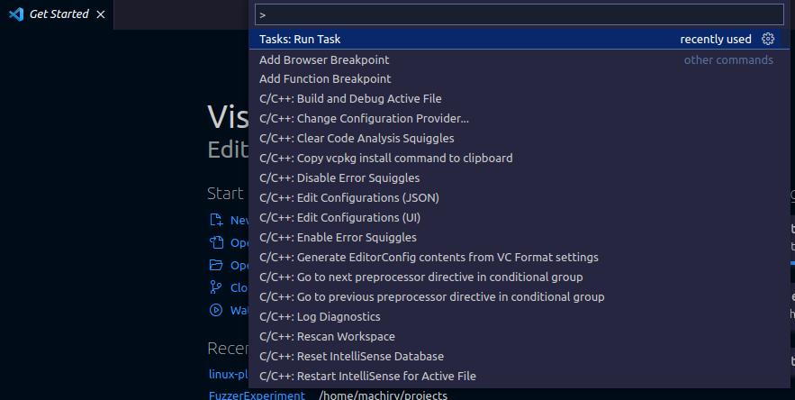
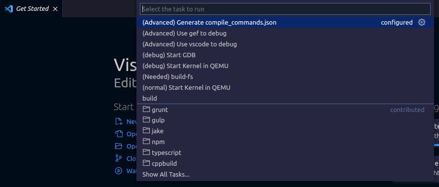
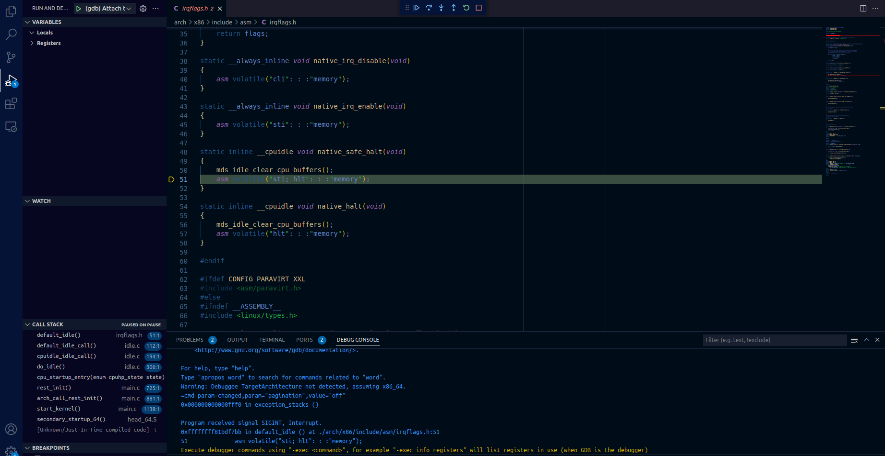
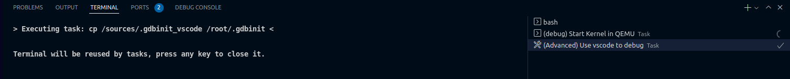

# Debugging the kernel

To debug the kernel, you need to first start the kernel in QEMU on debug mode. 

This is done by bringing up the command palette and typing: ``` Tasks: Run Task ```



Which should give you a prompt with multiple options. Select the `(debug) Start Kernel in QEMU` option. 



This should open up a new console where the Kernel is running.

If there are no errors, and you see no output on the console that means that kernel is waiting for the GDB stub to be connected.

> **Note** : You need to start the kernel first always before connecting to it with GDB. 

### Debugging inside VS Code

The default way of debugging is using the InBuilt VScode Native Debugger. This allows you to place breakpoints in the source code using VSCode itself.

#### Start kernel in Debug mode

To debug the kernel, you need to first start the kernel in QEMU on debug mode. This is done by bringing up the command palette and typing: ``` Tasks: Run Task ```

Which should give you a prompt with multiple options. Select the `(debug) Start Kernel in QEMU` option. This should open up a new console where the Kernel is running.

#### Setup debug using VSCode

To switch to Vscode debugging mode, from the gdb debugging mode, you need to run the ```(Advanced) Use vscode to debug``` task from the Vscode Tasks List.


#### Start debugging

To start the VScode debugger, you can press the <kbd>F5</kbd> key.

You can pause the debugger, i.e., break into running kernel by pressing the "Pause" button at the top. Once you press it, you should see the following screen:



Now, you can put a break point anywhere and work with kernel. For instance, 
1) I put a break point in `fork.c` as shown below and then I press resume.

2) Next, try running `ls` in the QEMU terminal and you should see the break point in fork hit as shown below:




### Debugging using GDB-Gef

You can use GDB-GEF instead of VScode by running the ```(Advanced) Use gef to debug``` task from the Vscode Tasks List.

Next, select the ```(debug) Start GDB``` task from the Vscode Tasks List, which should open up a new console where the debugger is running.
