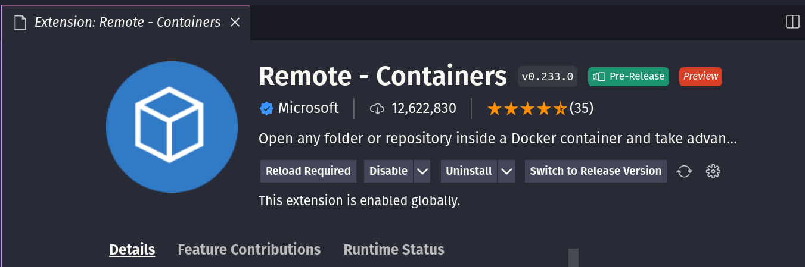
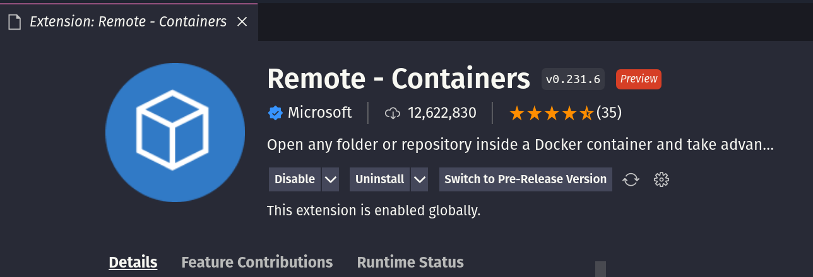

# Troubleshooting the installation

## Issues with the VSCode extension (remote-containers)

If your VSCode extension fails to create the container, or fails with an error message, you can try the following:

### 1. Confirm that your user has the permissions to create the container

Docker requires that the user running the container is a member of the group `docker`. 

You can check if your user is a member of the group by running the following command:

```bash
grep /etc/group -e "docker"
``` 

If you are not a member of the group, you can add yourself to the group by running the following commands:

- Create docker group : ```sudo groupadd docker```
- Add your user to the docker group : ```sudo usermod -aG docker $USER```
- Reboot or logout and login again

### 2. Switch to a different extension version

There is a chance that the extension you are using is not the release version. 

You can check the version of the extension by searching for it on the extension marketplace and clicking on the extension name.

A pre-release version of the extension looks like this: (Notice the `PreRelase` in the top as well as a button to switch to the Release version)



You should be able to switch to the release version by clicking on the button.



Now, try restarting VScode and recreating the container.